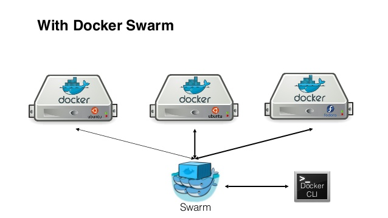
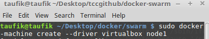
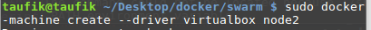
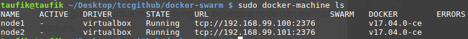
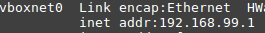
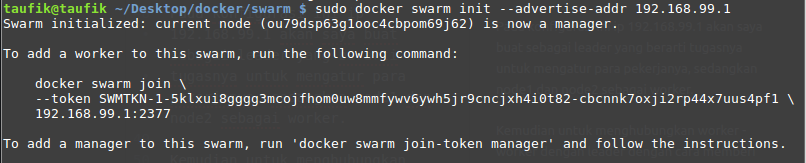
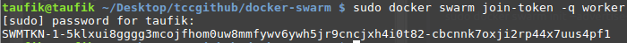
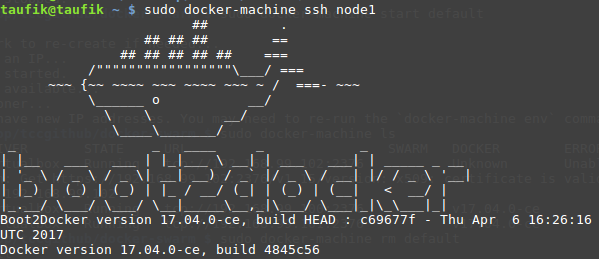
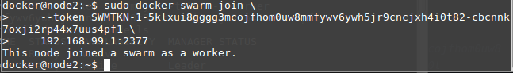
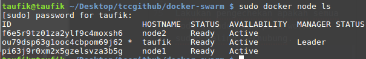

# DOCKER SWARM

**Docker swarm** ini dapat membantu kita untuk menggabungkan atau  mengelompokkan docker - docker yang sudah ada dan akan di kelompokkann dalam satu kelompok. Sehingga kita dapat mengatur semuanya dalam satu tempat, yaitu swarm dengan menggunakan Docker CLI.

 Gambar 1

Contoh gambar diatas merupakan simulasi ketika kita mempunyai tiga buah docker atau disebut juga dengan worker, yang dihubungkan menjadi satu yaitu docker swarm atau disebut juga sebagai leader.

## Docker Machine
**Docker Machine** merupakan tool yang kita instal pada docker engine dan berjalan diatas virtual host. Docker machine digunakan untuk memanage host dikomputer lokal kita.

### Cara instal Docker Machine
Pertama download terlebih dahulu apk docker machinenya pada link dibawah ini:
curl -L
> https://github.com/docker/machine/releases/download/v0.8.2/docker-machine-`uname -s`-`uname -m` >/usr/local/bin/docker-machine

Kemudian berikan hak akses file tersebut pada direktori seperti berikut:
> chmod +x /usr/local/bin/docker-machine

Jika sudah terinstal, gunakan perintah dibawah ini untuk mengechek apakah sudah terinstal.
> docker-machine -v

### Bagaimana cara instal Worker atau Node pada Docker Machine

Pada simulasi ini saya akan menggabungkan dua buah node dan satu leader, jadi terlebih dahulu saya instal dua buah worker/node dengan perintah seperti dibawah ini:
> docker-machine create --driver virtualbox node1

> docker-machine create --driver virtualbox node2

#catatan jika install seperti diatas maka memory dan disc akan secara default menggunkan memory 1GB dan disc 20GB. Jika akan install node dengan spesifikasi tertentu (dapat ditentukan sesuai keinginan) dapat menggunakan contoh perintah berikut ini:
>docker-machine create --driver virtualbox --virtualbox-memory "512" --virtualbox-disk-size "5000" node1

Chek docker machine yang  sudah terinstal atau yang sedang berjalan.
> docker-machine ls

## Join
**Join** merupakan proses menggabungkan beberapa beberapa node dan memilih salah satu node sebagai leader kemudian sisanya dijadikan sebagai worker.

Sebelum inisialisasi swarm, terlebih dahulu menentukan IP address pada virtualbox yang kita jalankan dengan perintah:
>ifconfig

Pada konfigurasi ini ip 192.168.99.1 akan saya buat sebagai leader yang berarti tugasnya untuk mengatur para pekerjanya, sedangkan node1 dan node2 sebagai worker.

Kemudian untuk menghubungkan worker - worker dengan leader dengan cara memberi token kepada para worker tersebut.
>sudo docker swarm init --advertise-addr 192.168.99.1

Chek token pada leader
>docker swarm join-token -q worker

Langkah berikutnya yaitu memasukan token leader tersebut pada masing - masing worker(node1 dan node2) dengan menggunakan ssh.
#catatan: pada langkah ini harus dilakukan dengan membuka terminal baru!!!

>docker-machine ssh node1

Masukan token leader pada masing - masing worker.
>docker swarm join \
>     --token SWMTKN-1-5klxui8gggg3mcojfhom0uw8mmfywv6ywh5jr9cncjxh4i0t
82-cbcnnk7oxji2rp44x7uus4pf1 \
>     192.168.99.1:2377

#catatan: lakukan konfigurasi permberian token ini pada setiap worker.

Lakukan pengechekan apakah semua node (leader dan para worker) sudah saling terhubung. Jika hasil seperti pada gambar berikut maka sudah saling terhubung.

>docker node ls

## Deploy Services ke Docker swarm

#tobeconued
